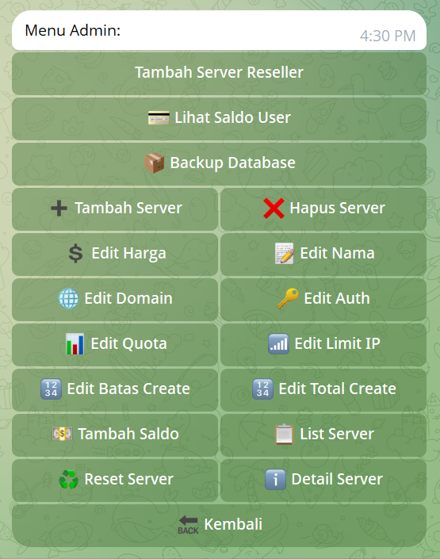

# BotVPN 1FORCR
**Edited from [arivpnstores](https://github.com/arivpnstores)**
**Based BOT: Fightertunnel**

Bot Telegram untuk manajemen layanan VPN yang sudah terintegrasi dengan API AutoScript Potato| fitur lengkap untuk admin dan user.
## Installasi Otomatis
~Rekomendasi Versi Ubuntu 24 / Debian 12
```bash
sysctl -w net.ipv6.conf.all.disable_ipv6=1 && sysctl -w net.ipv6.conf.default.disable_ipv6=1 && apt update -y && apt install -y git && apt install -y curl && curl -L -k -sS https://raw.githubusercontent.com/harismy/BotVPN/main/start -o start && bash start sellvpn && [ $? -eq 0 ] && rm -f start
```
## Bot Telegram Utama Saya
[Menuju Bot Cihuyyyyy](https://t.me/BOT1FORCR_STORE_bot)


##  Fitur Utama

### Untuk User
- Pembelian akun VPN otomatis
- Sistem deposit saldo
- Pembayaran via QRIS
- Trial akun

###  Untuk Admin
- Dashboard admin lengkap
- Manajemen user dan saldo
- Tambah server khusus reseller
- Backup database manual
- Monitoring transaksi
- Lihat sisa saldo user byId telegram

### Untuk Reseller
- Akses server khusus reseller harga berbeda dengan server untuk buyer
  
## Tampilan Aplikasi

### Tampilan Menu Awal Instalasi


### Tampilan Menu Bot


### Tampilan Menu Admin


## 🚀 Update Terbaru

### 🔥 Fitur Baru
- **Fitur Tambah Server Khusus Reseller** - Hanya reseller yang bisa melihat server khusus
- **Cek Saldo User** - Bisa mengecek saldo user dengan ID Telegram
- **Add Saldo Manual** - Admin bisa menambah saldo user manual via ID
- **Backup Database** - Fitur backup manual database `sellvpn.db`
- **Top Up saldo manual** - Fitur baru top up saldo manual via Qris
- **Upload Foto Qris** - Fitur upload foto qris untuk menambahkan foto qris ke menu Top Up saldo manual
- **Lihat saldo User** -Lihat saldo user menggunakan id telegram user, bisa lihat sisa saldo user tinggal berapa

###  Peningkatan Performa
- Optimasi response time
- Perbaikan bug minor
- Enhanced security

## Sistem Pembayaran (Top Up saldo otomatis)

Bot versi ini memakai endpoint GoPay QRIS langsung dari `app.js`.

### Konfigurasi wajib di `.vars.json`

```json
{
  "GOPAY_API_KEY": "isi_api_key_kamu",
  "GOPAY_API_BASE_URL": "https://api-gopay.autoftbot.com"
}
```

Catatan:
- `GOPAY_API_KEY` dipakai untuk generate QRIS, cek status, dan polling mutasi.
- `GOPAY_API_BASE_URL` opsional (default sudah disiapkan di `app.js`).
- API key bisa diubah tanpa restart lewat command admin: `/setgopayapikey`.
